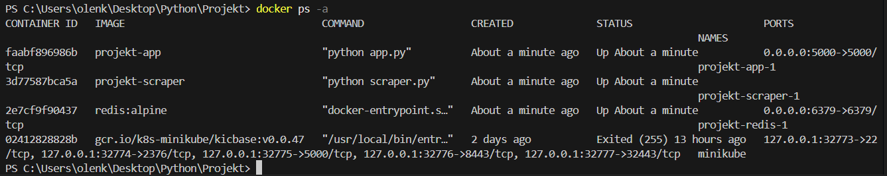
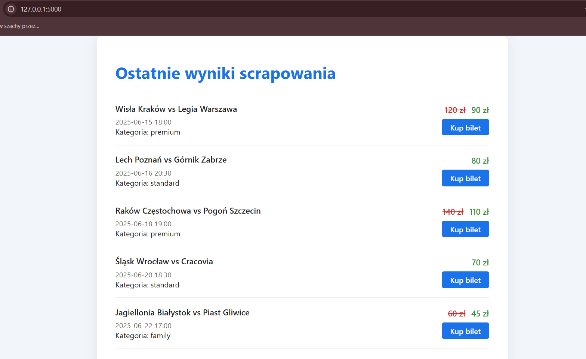
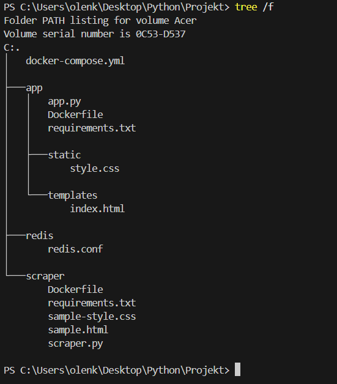
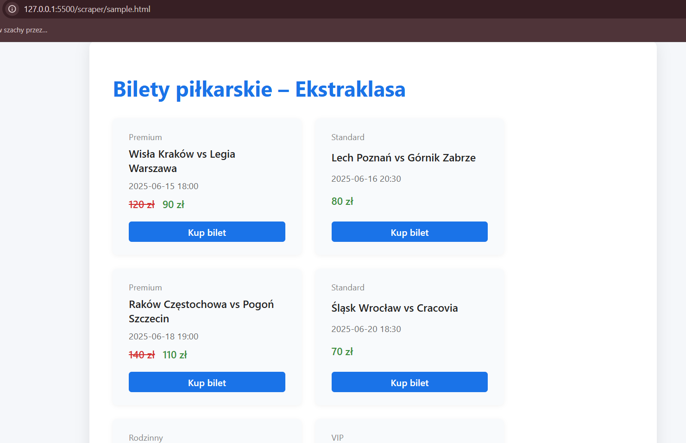

## Opis projektu

Aplikacja automatycznie pobiera, selekcjonuje i prezentuje dane o wydarzeniach sportowych (np. mecze piłkarskie) z wybranej strony internetowej lub pliku HTML. System działa w architekturze mikroserwisowej, zbudowanej z trzech niezależnych modułów uruchamianych w kontenerach Docker: scraper (silnik pobierający dane), aplikacja webowa (Flask) oraz baza danych Redis.

---

## Jak uruchomić aplikację

1. **Sklonuj repozytorium i przejdź do katalogu projektu.**

2. **Zbuduj i uruchom wszystkie kontenery za pomocą Docker Compose:**
docker-compose down -v
docker-compose up --build

3. **Sprawdź, czy wszystkie kontenery są uruchomione:**
Powinieneś zobaczyć trzy kontenery: `projekt-app`, `projekt-scraper`, `projekt-redis-1`.

4. **Otwórz aplikację w przeglądarce:**
http://127.0.0.1:5000
Zobaczysz graficzny interfejs z najnowszymi wynikami scrapowania:

---

## Struktura projektu

---

## Główne pliki

- **docker-compose.yml** – definiuje i uruchamia wszystkie usługi (kontenery) projektu.
- **app/app.py** – aplikacja Flask, wyświetlająca wyniki scrapowania.
- **scraper/scraper.py** – silnik scrapujący, cyklicznie pobierający i przetwarzający dane.
- **scraper/sample.html** – przykładowa strona do scrapowania.
- **app/templates/index.html** – szablon HTML interfejsu użytkownika.
- **app/static/style.css** – stylizacja interfejsu.
- **redis/redis.conf** – konfiguracja bazy danych Redis.

---

## Źródło danych do scrapowania

Plik `sample.html` w katalogu `scraper/` zawiera przykładowe mecze piłkarskie wraz z cenami biletów, kategoriami i datami wydarzeń.

---

## Technologie użyte w aplikacji

- **Python 3.10**
- **Flask** – interfejs webowy
- **BeautifulSoup** – parsowanie HTML
- **Redis** – baza danych (przechowywanie wyników scrapowania)
- **Docker, Docker Compose** – konteneryzacja i zarządzanie usługami
- **Multiprocessing, asyncio** – równoległe i asynchroniczne przetwarzanie danych

---

## Wnioski

Projekt jest rozproszony na trzy niezależne moduły, wykorzystuje nowoczesne technologie Python/Docker, umożliwia cykliczne scrapowanie i prezentację danych w przyjaznej formie. Architektura ułatwia skalowanie i dalszy rozwój aplikacji.

---

